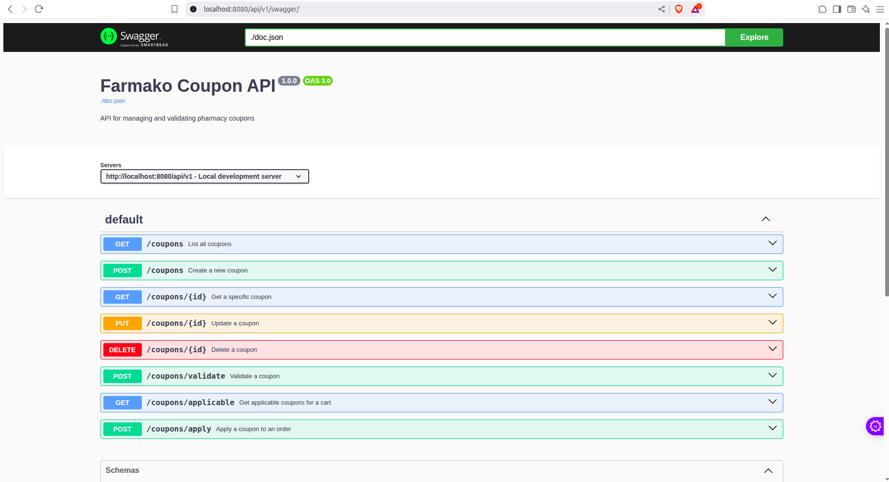

# Farmako - Pharmacy Coupon System

A comprehensive coupon management and validation system for an online pharmacy platform. The system allows administrators to create and manage coupons while providing a robust API for validation and application of coupons to customer orders.




## Features

- **Admin Coupon Management:** Create, update, delete, and list coupons
- **Coupon Validation:** Validate coupons against cart contents and user context
- **Automatic Coupon Discovery:** Find applicable coupons for a given cart
- **Flexible Discount Types:** Percentage or fixed amount discounts
- **Multiple Usage Options:** One-time, multi-use, or time-based coupons
- **Targeted Discounts:** Apply to specific medicines, categories, or the entire order
- **Concurrency Support:** Safely handle concurrent coupon validations and applications

## System Architecture

The system follows a clean architecture pattern with the following components:

- **Frontend:** React-based user interface for admin dashboard and customer views
- **Backend API:** Go-based RESTful API for coupon management and validation
- **Database:** PostgreSQL for persistent storage
- **Caching:** LRU cache implementation for frequently accessed coupons
- **Swagger UI:** API documentation and testing

The system is fully containerized with Docker and can be deployed locally or in the cloud.

## Setup Instructions

### Prerequisites

- Docker and Docker Compose
- Git

### Installation

1. Clone the repository:
   ```bash
   git clone https://github.com/MythicalMAxX/farmako.git
   cd farmako
   ```

2. Start the application:
   ```bash
   docker-compose up -d
   ```

3. Access the application:
   - Frontend: http://localhost:3000
   - Backend API: http://localhost:8080/api/v1
   - Swagger UI: http://localhost:8080/api/v1/swagger/

4. .env variabls
   - Backend
   ```
   DB_DRIVER=sqlite
   DB_NAME=coupon_system.db
   SERVER_PORT=0000
   ```
   - Frontend
   ```
   REACT_APP_API_URL=http://localhost:8080/api/v1
   ```

### Manual Setup (Without Docker)

#### Backend

1. Navigate to the backend directory:
   ```bash
   cd backend
   ```

2. Install dependencies:
   ```bash
   go mod download
   ```

3. Run the application:
   ```bash
   go run cmd/api/main.go
   ```

#### Frontend

1. Navigate to the frontend directory:
   ```bash
   cd frontend
   ```

2. Install dependencies:
   ```bash
   npm install
   ```

3. Start the development server:
   ```bash
   npm start
   ```

## API Documentation

The API is documented using OpenAPI/Swagger. Access the Swagger UI at:

- http://localhost:8080/api/v1/swagger/

The API provides the following endpoints:

- `GET /coupons`: List all coupons
- `POST /coupons`: Create a new coupon
- `GET /coupons/{id}`: Get a specific coupon
- `PUT /coupons/{id}`: Update a coupon
- `DELETE /coupons/{id}`: Delete a coupon
- `POST /coupons/validate`: Validate a coupon against a cart
- `POST /coupons/apply`: Apply a coupon to an order
- `GET /coupons/applicable`: Get applicable coupons for a cart

## Concurrency, Caching, and Locking

### Concurrency

The system handles concurrent coupon validations through several mechanisms:

1. **Mutex Locking:** Uses sync.RWMutex for thread-safe operations on shared data
2. **Request-Scoped Context:** All operations use Go's context.Context for propagating deadlines and cancellation signals
3. **Idempotent Operations:** API endpoints are designed to be idempotent to handle retries safely

### Caching

The system implements an LRU (Least Recently Used) cache for coupon data:

1. **TTL Expiration:** Cache entries expire after a configurable time-to-live
2. **Size Limitation:** Cache is limited to a configurable number of entries
3. **Thread-Safe Operations:** All cache operations are protected by mutex locks

### Database Transaction Safety

1. **Optimistic Concurrency Control:** Uses version-based concurrency control for updates
2. **ACID Transactions:** All database operations respect ACID properties
3. **Connection Pooling:** Efficient management of database connections

## Requirements Checklist

- ✅ Core API Endpoints
  - ✅ GET /coupons
  - ✅ POST /coupons
  - ✅ GET /coupons/{id}
  - ✅ PUT /coupons/{id}
  - ✅ DELETE /coupons/{id}
  - ✅ POST /coupons/validate
  - ✅ POST /coupons/apply
  - ✅ GET /coupons/applicable

- ✅ Technical Requirements
  - ✅ Concurrency-aware design
  - ✅ Persistent storage
  - ✅ Request-scoped context handling
  - ✅ Caching (LRU with TTL)
  - ✅ OpenAPI/Swagger documentation
  - ✅ Dockerized application

- ✅ Frontend
  - ✅ Admin dashboard for coupon management
  - ✅ Customer view for applying coupons
  - ✅ Responsive design

# farmako
